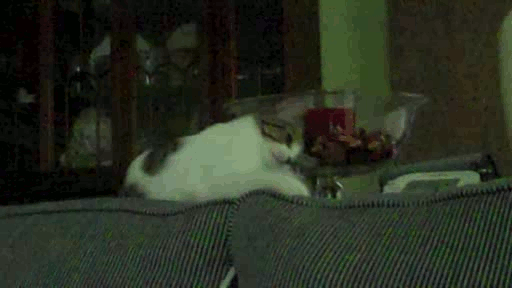

# Catslap


LDAP REST microservice with Password Policy overlay support

## The "Why"

Because why not? 

### Why should I use it?

OpenLDAP comes with the awesome [Password Policy](http://www.zytrax.com/books/ldap/ch6/ppolicy.html) overlay, which adds password and authentication policy enforcement directly into SLAPD itself. This layer of security is immediately applied against any system using LDAP as an authentication provider with zero client-side changes.

***However!*** Such overlays are part of LDAPv3, which adds richer return data, but most common languages do not support providing this data when using the `bind` function. An LDAP bind will work the same regardless, but will lack this informative data (e.g. account locked, password reset required, etc.).

*Catslap* provides this detailed LDAP authentication as a REST microservice that can be incorporated into any application's authentication process. *Catslap* also acts as middleware security to isolate your LDAP services from your other applications (your apps won't require administrative bind credentials). Also, because *Catslap* is powered by [Mojolicious](http://mojolicious.org), horizontal scaling and zero-downtime hot redeployment are effortless through the built-in [Hypnotoad](http://mojolicious.org/perldoc/Mojolicious/Guides/Cookbook#Hypnotoad) pre-forking web server.

### Why Perl?

The [`Net::LDAP`](https://metacpan.org/pod/Net::LDAP) Perl module includes full support for the LDAPv3 Password Policy overlay (via the [`Net::LDAP::Control::PasswordPolicy`](https://metacpan.org/pod/Net::LDAP::Control::PasswordPolicy) module). Perl is seemingly the only major web language with such complete support.

### Why the name?

There is a utility that comes with OpenLDAP called [`slapcat`](https://linux.die.net/man/8/slapcat)`(8)`, and since bad puns are ***the*** highest form of comedy, *Catslap* was born! :D

## Installation

**Notice**: This assumes we will be installing and running *Catslap* as the `meow` user, installed in `/home/meow/catslap`.

### Requirements

* Perl 5.20 or greater
* [cpanminus](https://github.com/miyagawa/cpanminus) or [Carton](https://github.com/perl-carton/carton)
* OpenLDAP SLAPD service with Password Policy overlay, users, superusers, and groups configured

#### Perl Dependencies

These will be installed in the next step.

* [Mojolicious](https://metacpan.org/pod/Mojolicious)
* [Net::LDAP](https://metacpan.org/pod/Net::LDAP)

### Install

1. `cd` to the parent directory where *Catslap* will be installed:

```
meow@server:/home/meow$ cd /home/meow/catslap
```

2. Install the Perl CPAN module dependencies:


```
# if using cpanminus
# (include the trailing dot!)
meow@server:/home/meow/catslap$ cpanm --installdeps .

# if using Carton
meow@server:/home/meow/catslap$ carton install
```

3. Configure *Catslap*, by copying `catslap.conf.example` to `catslap.conf` and editing it, following the comments within.

4. Set *Catslap* to start with your server using either the supplied startup scripts, or using system utilities like Systemd or Supervisord.

## Usage

**Notice**: This assumes we installed *Catslap* as the `meow` user in `/home/meow/catslap`.

```
meow@server:/home/meow/catslap$ ./bin/catslap
Catslap listening on http://localhost:31195/
meow@server:/home/meow/catslap$
```

-----

<small>No cats were slapped in the making of this software. =^^=</small>
